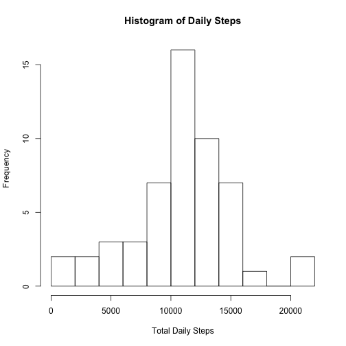
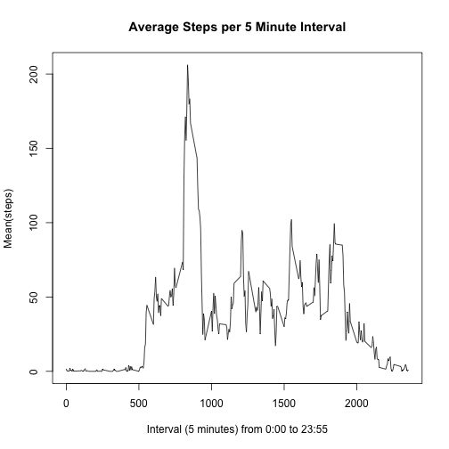
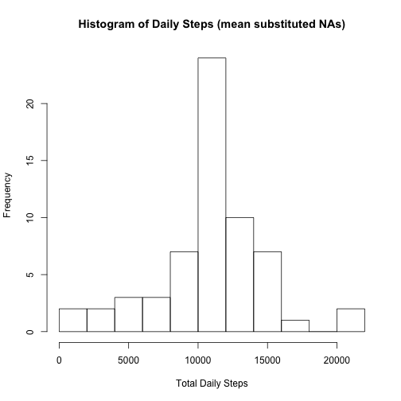
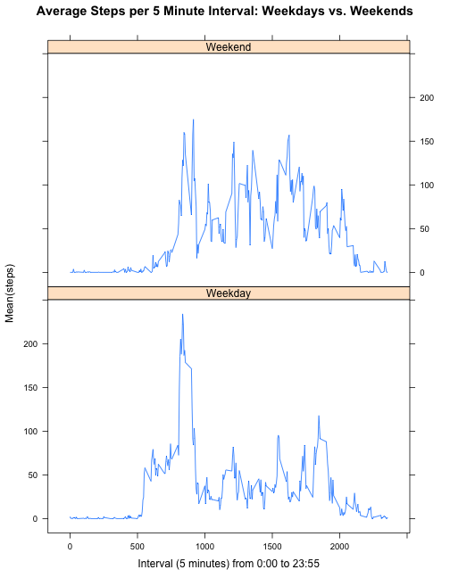

Author: Len Greski<br>
Date: October 14, 2015

This report is submitted in fulfillment of requirements for the Johns Hopkins University Data Science curriculum couse in *Reproducible Research*, [Peer Assessment 1](https://github.com/rdpeng/RepData_PeerAssessment1/blob/master/doc/instructions.pdf) conducted during October 2015. 

## Loading and preprocessing the data
In this section of the analysis we check whether the input data file `activity.csv` is in the *R Working Directory*, and download the zip version if necessary. Then we unzip the downloaded file. Before the download, we determine whether the code is running on a Windows-based operating system and specify the correct method (curl or wininet). 

```r
if(!file.exists("activity.csv")){
     dlMethod <- "curl"
     if(substr(Sys.getenv("OS"),1,7) == "Windows") dlMethod <- "wininet"
     url <- "https://d396qusza40orc.cloudfront.net/repdata%2Fdata%2Factivity.zip"
     download.file(url,destfile='activity.zip',method=dlMethod,mode="wb")
     unzip(zipfile = "activity.zip")    
}
```

For reading the file we prefer Hadley Wickham's `readr` package to the base functionality, because `readr` runs orders of magnitude faster than read routines in Base R. The data is comma separated, so we'll use `read_csv` to load the activity data.  


```r
library(readr)
activityData <- read_csv("activity.csv",
     col_types=list(col_double(),col_character(),col_double()))
```
The unit of analysis or "observation" in the input file is a the number of steps taken in a five minute interval for a single individual. Therefore, each day includes 288 individual observations. The following codebook describes the variables included in the data set, along with their data types and ranges. 

### Codebook

<table>
<tr><th align="left" >Field</th><th align="left">Description</th></tr>
<tr><td valign="top">steps</td><td>Number of steps taken by the individual, a numeric variable.<br> Range of values: 0 to 806, with 2,304 NA values. <br><br></td></tr>
<tr><td valign="top">date</td><td>Date on which the steps were recorded, read as a character variable. <br>Range of values: 2012-10-01 to 2012-11-30, a total of 61 days. The values are in YYYY-MM-DD format. No missing values.<br><br> </td></tr>
<tr><td valign="top">interval&nbsp;&nbsp;</td><td>Five minute interval value, calculated as minutes elapsed from the beginning of the day, a numeric variable.<br>Range of values: 0 to 2,355. No missing values.<br><br> </td></tr>
</table>

To analyze the data by day, we'll need to aggregate the number of steps by day. The `aggregate()` function ignores missing values by default, so the output data frame will have no missing values for the `steps` column. Since there was a fair amount of discussion on the course Discussion Forum about how to omit missing values on the `aggregate()` function, we've explicitly set the `na.action` parameter. 


```r
dailySteps <- aggregate(steps ~ date,
     FUN=sum,data=activityData,na.action="na.omit")
```


## What is mean total number of steps taken per day?

One way to look at the distribution of steps data is to generate a histogram. We will adjust the default of 5 break points to 8 so we can obtain a more detailed picture of the variability between 10,000 and 15,000 steps per day than is generated by the default histogram. 


```r
hist(dailySteps$steps,
     main="Histogram of Daily Steps",
     xlab="Total Daily Steps",
     breaks = 8)
```

 

Another way to look at the distribution of numbers is with a stem and leaf diagram, which illustrates the underlying data values in the histogram. In the stem and leaf diagram we see a similar pattern as was rendered by the histogram, illustrating the three leftmost significant digits in the daily steps vector. 


```r
stem(dailySteps$steps)
```

```
## 
##   The decimal point is 3 digit(s) to the right of the |
## 
##    0 | 01
##    2 | 52
##    4 | 504
##    6 | 803
##    8 | 3488989
##   10 | 1112344668024588
##   12 | 1468893556
##   14 | 3511144
##   16 | 4
##   18 | 
##   20 | 42
```

The mean number of steps per day is 10,766.19 and the median number of steps per day is 10,765 as per the following `summary()` output. Note that unless the `digits` parameter is set in the `summary()` function, it returns a mean and median that do NOT match the results of the `mean()` and `median()` functions. Therefore, we've set `digits=7` to match the results from `mean()` and `median()`. 

Since we'll need to compare this summary to a version with mean substituted missing values later in the analysis, we'll also calculate skewness and kurtosis. For these statistics, we'll need the `moments` package. 

A skewness value of -0.31 means that the distribution of daily steps is slightly negatively skewed (i.e. asymetrical towards the low end of the distribution). A kurtosis value of 3.73 indicates the data is leptokurtic (i.e. it has a higher peak than a normal distribution, which would have a kurtosis of 3.0). 

```r
summary(dailySteps$steps,digits=7)
```

```
##     Min.  1st Qu.   Median     Mean  3rd Qu.     Max. 
##    41.00  8841.00 10765.00 10766.19 13294.00 21194.00
```

```r
mean(dailySteps$steps)
```

```
## [1] 10766.19
```

```r
median(dailySteps$steps)
```

```
## [1] 10765
```

```r
library(moments)
skewness(dailySteps$steps)
```

```
## [1] -0.3103567
```

```r
kurtosis(dailySteps$steps)
```

```
## [1] 3.730805
```


## What is the average daily activity pattern?
The daily activity pattern illustrates the number of steps per five minute period, aggregated across all days. First, we'll aggregate the steps data to the average steps per five minute period, across all days. Then we'll display the result in an X / Y plot. 


```r
dailyPattern <- aggregate(steps ~ interval,FUN=mean,data = activityData)
plot(dailyPattern$interval,dailyPattern$steps,
     type="l",
     main="Average Steps per 5 Minute Interval",
     xlab="Interval (5 minutes) from 0:00 to 23:55",
     ylab="Mean(steps)")
```

 

The five minute interval with the maximum number of steps on average is interval 835, or 8:35AM, with an average of slightly more than 206 steps over all of the days in the activity data set.


```r
dailyPattern[dailyPattern$steps == max(dailyPattern$steps),] 
```

```
##     interval    steps
## 104      835 206.1698
```

## Imputing missing values

The total number of missing values in the data set is 2,304, as noted above in the code book and the `summary()` analysis of the `steps` column, and we confirm this by summing the result of the `is.na()` function. Additional investigation of the missing values shows that they are isolated to 8 days, per the following `table()`. Each day that has any missing values is missing all intervals for the entire day.  


```r
sum(is.na(activityData$steps))
```

```
## [1] 2304
```

```r
table(activityData[is.na(activityData$steps),"date"])
```

```
## 
## 2012-10-01 2012-10-08 2012-11-01 2012-11-04 2012-11-09 2012-11-10 
##        288        288        288        288        288        288 
## 2012-11-14 2012-11-30 
##        288        288
```

Multiple approaches may be taken to substitute missing values with a valid value, ranging from the daily mean steps, the interval mean steps, or using medians of thse values. Since there are 288 observations in the dailyPattern data frame, we know we have valid observations for each interval in the day. Also, since the number of steps on average varies significantly by interval, the average per interval is arguably a more appropriate missing value substitution strategy than taking the average for each day. 

We will merge the the `dailyPattern` data frame with the `activityData` frame by interval, after renaming the `steps` column in `dailySteps` to `avgSteps`. The technical approach taken for mean substitution is to create a logical vector for the rows where `is.na(steps)` is TRUE, and to use that vector to conditionally assign the average steps by interval to the `steps` column.  


```r
theNames <- colnames(dailyPattern)
theNames[2] <- "avgSteps"
colnames(dailyPattern) <- theNames 
mergedActivity <- merge(activityData,dailyPattern,by="interval",all.x=TRUE)
mergedActivity$theNAs <- is.na(mergedActivity$steps)
mergedActivity$steps[mergedActivity$theNAs] <- mergedActivity$avgSteps[mergedActivity$theNAs]
```

As a data check, we confirm the number of observations where we substituted the averge steps per interval is 2,304 with the following function. Note that there are 19 intervals where the average steps within an interval is 0, so we couldn't simply count the number of rows where `steps == avgSteps`. 


```r
nrow(mergedActivity[mergedActivity$steps == mergedActivity$avgSteps &
          mergedActivity$theNAs == TRUE,])
```

```
## [1] 2304
```

Next, we re-aggregate the data and generate a histogram and mean / median on the data frame with mean substituted missing values. 


```r
dailySteps <- aggregate(steps ~ date,FUN=sum,data=mergedActivity)

hist(dailySteps$steps,
     main="Histogram of Daily Steps (mean substituted NAs)",
     xlab="Total Daily Steps",
     breaks = 8)
```

 

The mean daily steps is now 10,766.19 (no change from the original value) and the median daily steps is now also 10,766.19, which is 1.19 steps higher than the original analysis where we excluded observations that had missing values for the number of steps. Mean substitution of missing values moved the median closer to the mean. 

The skewness of the mean-substituted data is -0.33, indicating that the mean substitution did not substantively change the skewness of the data. However, the kurtosis value of the mean substituted data is 4.29, indicating that the new distribution has an even higher peak than the original data. Mean substitution had the effect of concentrating the data towards the center of the distribution, which makes sense substantively because adding new observations with means would tend to move the overall distribution towards its central tendency. 


```r
summary(dailySteps$steps,digits=7)
```

```
##     Min.  1st Qu.   Median     Mean  3rd Qu.     Max. 
##    41.00  9819.00 10766.19 10766.19 12811.00 21194.00
```

```r
skewness(dailySteps$steps)
```

```
## [1] -0.332957
```

```r
kurtosis(dailySteps$steps)
```

```
## [1] 4.293945
```

A different mean substitution strategy could have a materially different impact on the data. Therefore, whenever mean (or median) substitution is used to replace missing values, it's important to assess the impact of the substitutions on the distribution of values prior to subsequent analysis of the data. 

## Are there differences in activity patterns between weekdays and weekends?
To answer this question, we'll need to calculate day of week from the `date` column, and use it to re-aggregate the activity data and generate two charts. From the charts we observe that weekends appear to have a consistently higher overall level of activity throughout the daytime hours than weekdays.  

Output from the `summary()` function confirms this, because the median, mean, and 75th percentile for the weekend data are all higher than the corresponding values for weekdays, even though the maximum value from weekdays is higher than the maximum on weekend days. 

Since there there is more weekday data than weekend data, the weekday chart looks more similar to the original chart of average steps per time interval than the weekend chart. 

<table>
<tr><th>Measure&nbsp;&nbsp;&nbsp;</th><th>Weekend</th><th>Weekday</th><tr>
<tr><td>Median</td><td>32.04</td><td>23.97</td></tr>
<tr><td>Mean</td><td>43.08</td><td>35.34</td></tr>
<tr><td>75th %ile</td><td>75.57</td><td>51.87</td></tr>
<tr><td>Maximum</td><td>175</td><td>234</td></tr>
</table>

Both weekdays and weekends show peak activity in the morning, as was described earlier in the analysis where the interval where the maximum average steps occurred was 8:35AM.  


```r
# dayOfWeek is an integer from 0 = "Sunday" to 6 = "Saturday"
activityData$dayOfWeek <- as.POSIXlt(activityData$date)$wday
activityData$dayType <- "Weekday"
activityData$dayType[which(activityData$dayOfWeek %in% c(0,6))] <- "Weekend"
pattern <- aggregate(steps ~ dayType + interval,FUN=mean,data = activityData)

library(lattice)
xyplot(steps ~ interval | dayType,
     pattern,
     main = "Average Steps per 5 Minute Interval: Weekdays vs. Weekends",
     xlab="Interval (5 minutes) from 0:00 to 23:55",
     ylab="Mean(steps)",
     lty=1,
     type="l",
     layout=c(1,2))
```

 

```r
summary(pattern[pattern$dayType=="Weekday","steps"])
```

```
##    Min. 1st Qu.  Median    Mean 3rd Qu.    Max. 
##   0.000   2.218  23.970  35.340  51.870 234.100
```

```r
summary(pattern[pattern$dayType=="Weekend","steps"])
```

```
##    Min. 1st Qu.  Median    Mean 3rd Qu.    Max. 
##   0.000   1.107  32.040  43.080  75.570 175.000
```

